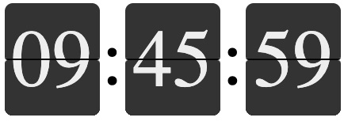

# SplitFlapDisplay

Welcome to the SplitFlapDisplay project! This project simulates the nostalgic mechanical split-flap displays commonly seen in train stations or airports. These displays provide a visually appealing way to show text updates dynamically.



## Installation

To get started with the SplitFlapDisplay, simply download the project files and include them in your HTML project.

1. Clone or download the repository.
2. Include the JavaScript and CSS files in your HTML:
```html
<link rel="stylesheet" type="text/css" href="src/splitflap.css">
<script src="src/splitflap.js"></script>
```

## Components

This project consists of two main components:

- `SplitFlapDisplay`: The main display controller which manages multiple segments.
- `SplitFlapSegment`: Represents a single segment of the display. This component is typically managed by `SplitFlapDisplay` and should not need direct interaction.
Users should primarily interact with the `SplitFlapDisplay` component to manage the display.

## HTML Element Setup

Define a parent element in your HTML to host the split flap display. For example:

```html
<div id="myDisplay"></div>
```
### JavaScript Initialization
Initialize the display using the following JavaScript code:

```javascript
const myDisplay = new SplitFlapDisplay(document.getElementById('myDisplay'), {
    numSegments: 4,
    alphabet: 'ABCDEFGHIJKLMNOPQRSTUVWXYZ',
    initialValue: 'TEST'
});
```

Note, you can use different alphabets for different segments by providing an array of alphabets in `alphabets`instead a single `alphabet`. Then number of alphabets and number of segments must match.

### Automatic Segment Creation

Segments can be automatically created based on `numSegments` or the number of elements in `initialValue`. 

### Manual Segment Creation / Customization

Alternatively, if the parent element contains child elements with the class segment, these will be used as the segments of the display.
```html
<div id="myDisplay">
    <div class="segment"></div>
    <span>:</span>
    <div class="segment"></div>
</div>
``` 
## Configuration
### Alphabets
Each segment can have its own alphabet, which can consist of single letters, digits, or even longer strings. For example:

Alphabet for numbers: `['0', '1', '2', '3', ..., '9']`
Alphabet for an elevator display: `['-1', ' G', ' 1', ' 2', ' 3', ' 4']`
### Updating Values
Use the `flipTo(value)` method to update the display. The display will run through the alphabet until the target value is reached. Values for `initialValue` or `flipTo` can be either an array of strings or a single string. A single string will be split into characters if there are more than one segment in the display.
```javascript
myDisplay.flipTo('DONE');
```
### Styling
Customize the appearance of your display via CSS. Modify the size or font of segments by adjusting styles in `.segment` class or change the coloring of the `.flap` class. Additional classes can be added to style different segments individually. Examples of how to adapt styling can be found in `example.html`.

```css
#myDisplay .segment {
    font-size: 50px;
    color: black;
    width: 1.2em;
    height: 1.4em;
}
#myDisplay .flap {
    box-sizing: border-box;
    background-color: white;
    border: 1px solid black;
}
```

## Examples
See example.html for practical examples of how to implement and style the `SplitFlapDisplay`.

## Contribution
This is an open-source project, and contributions are welcome! Feel free to fork the repository, make improvements, and submit pull requests.

